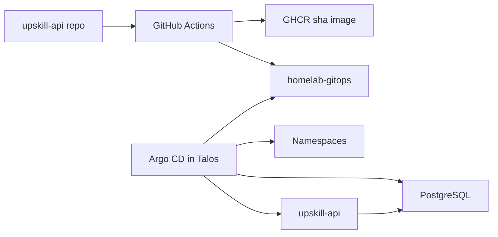

# Architecture

Repository ownership:

- `upskill-api`: app code, tests, Alembic migrations, Dockerfile, image release workflow.
- `homelab-gitops`: Kustomize deployment state, Argo CD applications, environment promotion.

This deliberately mirrors a production split where application teams publish immutable artifacts and platform/GitOps state declares where those artifacts run.
