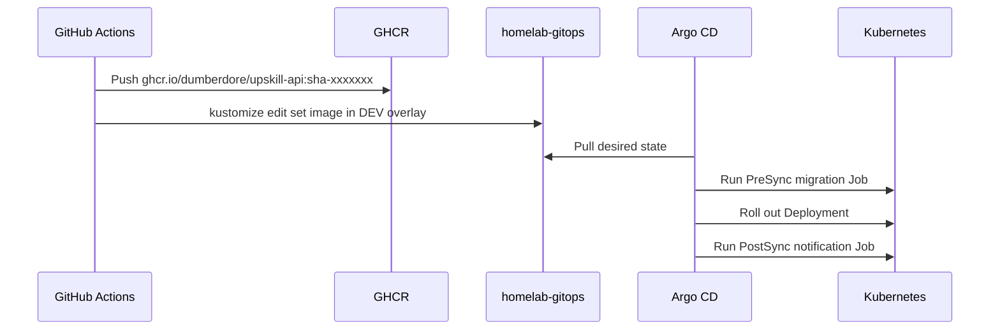

# Deployment

Deployment is Kustomize-based.

DEV application flow:

The app ServiceAccount is also created as an early PreSync prerequisite so migration Jobs can run without using the namespace default ServiceAccount.

The PostSync notification Job is currently a placeholder that logs the deployment result. Later it should read a Slack webhook URL from a Kubernetes Secret and post to the release/operations Slack channel.

GitHub Actions never runs `kubectl` and never needs cluster credentials.

PostgreSQL is deployed from this repo to emphasize that environment dependencies and app code are separate concerns.
